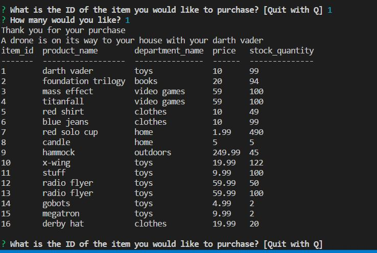

<h1>Bamazon customer and manager applications</h1>

There are two applications here to help you run your online store:

1. bamazonCustomer.js
1. bamazonManager.js

Let's detail what each one does:

<h2>bamazonCustomer.js</h2>

This app will be the consumer-facing part of your store. Customers will see the products for sale, select a product to purchase. If the customer orders more products than you have available, the customer will receive an error message.

<h2>bamazonManager.js</h2>

This app will allow you to do four things:

1. View products for sale
1. View low inventory
1. Add to Inventory
1. Add New Product

Check out both apps and hopefully I loaded the package.jsons correctly this time. 

*Note: The Supervisor app was attempted but not completed in time for the deadline of this assignment*